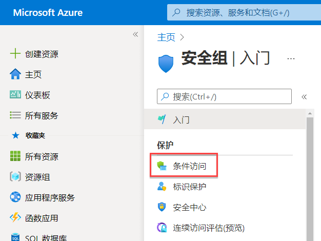
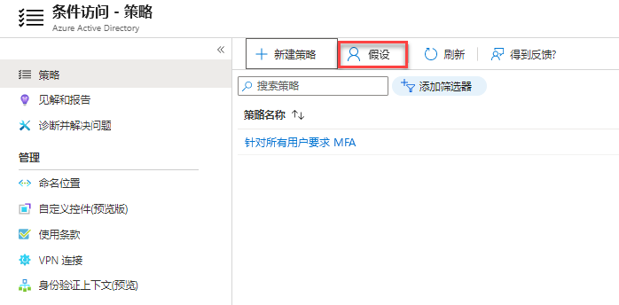
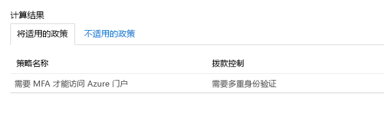

# 模块 3 - 实验室 1 - 练习 1 - MFA 身份验证试点（要求具有 Azure Active Directory 条件访问权限的特定应用进行 MFA）

### 任务 1：创建你的条件访问策略 

本实验室展示了如何创建所需的条件访问策略以要求对某些用户执行 MFA。 该场景使用：

- Azure 门户作为需要 MFA 的云应用的占位符。 
- 示例用户来测试条件访问策略。  

在策略中，设置：

|设置 |值|
|---     | --- |
|用户和组 | Patti Fernandez |
|云应用 | Microsoft Azure 管理 |
|授予访问权限 | 需要多重身份验证 |

 
1.  以 Holly Dickson 身份使用密码 `Pa55w.rd` 登录 Azure 门户 `https://portal.azure.com`。

2.  在 Azure 门户中，在中心菜单上转到 Azure Active Directory，必要时使用“更多服务”进行搜索。

3. 在左侧单击“安全性”，然后选择“条件访问” 。

     
 
5.  在“条件访问”页面顶部的工具栏中，单击“新建策略”，然后选择“创建新策略”。  

    **注**：如果此按钮显示为灰色，请刷新浏览器会话页面。

6.  在“新建”页面的“名称”文本框中，键入 `Require MFA for Azure portal access`。 

7.  在“分配”部分，单击“已选择 0 个用户或工作负载标识”。 

8.  在“用户和组”页，执行以下步骤：

    a. 单击“选择用户和组”，然后选择“用户和组” 。
    

    b. 在“选择”页上选择 `Patti Fernandez`，然后单击“选择”。 

9.  返回“新建”页面的“云应用或操作”部分，单击“没有选择云应用、操作或身份验证上下文”。 

10. 在“云应用或操作”页上执行以下步骤：

    a. 单击“选择应用”。

    b. 在“选择”页上，选择“Microsoft Azure 管理”，然后单击“选择”  。

11.  在“授予”下的“访问控制”部分，单击“已选择 0 个控件”。  

12.  在“授权”页，执行以下步骤：
     1. 选择“授予访问权限”。
     2.  选择“需要多重身份验证”  。
     3.  单击“选择”。

13.  在“启用策略”部分中，单击“开” 。

14.  单击“创建”。

    ‎注意：若策略失败，请检查工作，然后再次“创建”。

### 任务 2：评估模拟登录

你已经配置了条件访问策略，现在可能想知道它是否按预期工作。 第一步，使用条件访问 what if 策略工具模拟测试用户登录。 该模拟会估计此登录对策略的影响并生成模拟报表。  

我们将针对以下情况初始化 What If 策略评估工具：

- “Patti Fernandez”作为用户 
- **Microsoft Azure 管理** 作为云应用

 单击“What If”会创建一个模拟报告，该报告：

- 在“将应用的策略”下显示“需要 MFA 才能访问 Azure 门户” 
- 显示“需要多重身份验证”作为“授权控件”。

1.  在条件访问-策略页面的顶部菜单中，单击“模拟”。  
 
     

2.   在“工作负载或用户标识”下，单击“未选择用户”，选择 `Patti Fernandez`，然后单击“选择”。  

3.  若要选择云应用，请执行以下步骤：

    a. 在“云应用、操作或身份验证上下文”页面上，选择“任意云应用”。 

    b. 单击“选择应用”。

    c. 在“选择”页上，选择“Microsoft Azure 管理”，然后单击“选择”  。

4.  在 What If 页面中，选择“What If”。

5.  注意结果，需要 MFA 才可访问 Azure 门户。

     

### 任务 3：测试你的条件访问策略

在上一部分中，你已经了解如何评估模拟登录。 除了模拟之外，你还应该测试条件访问策略，确保其按预期工作。 

要测试策略，请打开 InPrivate 浏览会话，然后尝试使用 Patti Fernandez 帐户登录到 Azure 门户 `https://portal.azure.com`。  你应该会看到一个对话框，要求你为帐户设置额外的安全性验证。

## 继续进行练习 2。
