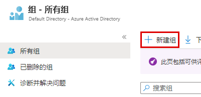
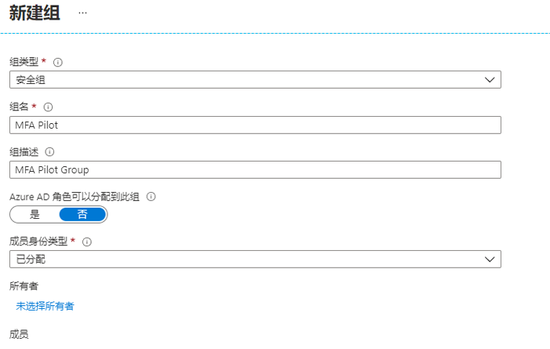

# 模块 3 - 实验室 1 - 练习 2 - MFA 条件访问（完成 Azure 多重身份验证试点发布）

在本练习中，你将配置条件访问策略，在登录到 Azure 门户时启用 Azure 多重身份验证 (Azure MFA)。此策略针对特定的试点用户组进行部署和测试。与传统的强制方法相比，使用条件访问部署 Azure MFA 为组织和管理员提供了显着的灵活性。

- 启用 Azure 多重身份验证
- 测试 Azure 多重身份验证

### 任务 1：启用 Azure 多重身份验证

1.  返回到以全局管理员 Holly Dickson 的身份登录的 Azure 门户。

1.  在“中心”上，转到“**Azure Active Directory**”。

1.  单击“**组**”，然后单击“**+ 新建组**”。

     

1.  输入以下信息，然后选择“**创建**”：

      * 组类型；`Security`
      * 组名： `MFA Pilot`
      * 组描述： `MFA Pilot Group`
      * 成员身份类型： `Assigned`
      * 成员：选择 `Lynne Robbins`
  
  
      
  
2.  浏览到“**Azure Active Directory**”，单击“**安全**”，然后在“**策略**”边栏选项卡上选择“**条件访问**”。

3.  选择“**+ 新建策略**”

4.  将策略命名为 `MFA Pilot`
5.  在“**用户和组**”下，单击“**选择了 0 个用户和组**”。选择“**选择用户和组**”单选按钮并选中“**用户和组**”框。
    * 选择你的试点组 `MFA Pilot`
    * 单击“**选择**”

6.  单击“**云应用或操作**”，选择“**选择应用**”单选按钮。
    * 单击“**选择**”。Azure 门户的云应用为 `Microsoft Azure Management`，请选择它。
    * 单击“**选择**”

7.  跳过“**条件**”部分
8.  单击“**授权**”，确保选中“**允许访问**”单选按钮
    * 选中“**需要多重身份验证**”复选框
    * 单击“**选择**”

9.  跳过“**会话**”部分
10. 将“**启用策略**”设置为“**开启**”
11. 单击“**创建**”

    **备注**：若策略失败，请检查工作，然后再次“**创建**”。

### 任务 2：测试 Azure 多重身份验证

为了证明你的条件访问策略有效，你需要测试登录到不需要 MFA 的资源，然后登录到需要 MFA 的 Azure 门户。

2.  在 InPrivate 或 incognito 模式下打开新的浏览器窗口，然后浏览到 **`https://portal.azure.com`**

       * 使用 Lynne Robbins 用户身份进行登录（Lynne 的密码可能与实验室托管服务提供商提供的 MOD 管理员密码相同），注意现在应注册并使用 Azure 多重身份验证。
       * 关闭浏览器窗口。

# 实验室结束
