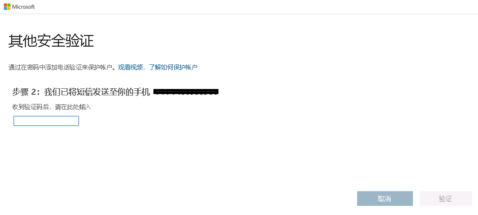

# 模块 3 - 实验室 2 - 练习 1 - 管理 Azure 资源

**应用场景**

在本实验室中，你将学习如何使用 Azure Privileged Identity Management (PIM) 来启用即时管理并控制可以执行特权操作的用户数量。你还将了解可用的不同目录角色以及更新的功能，其中包括将 PIM 扩展到资源级别的角色分配。 

### 任务 1：发现资源

1.  若仍以 MOD 管理员身份登录 Microsoft 365 管理中心，请将用户切换为 Holly Dickson。转到 **Azure 门户** `https://portal.azure.com/`，并以全局管理员 Holly Dickson 的身份登录，单击“**所有服务**”，然后搜索并选择 `Azure AD Privileged Identity Management`。

     

1.  单击同意 PIM（若显示）。由于一些租户中已启用 PIM，因此可省去这些步骤。

     

1.  单击“**验证我的身份**”（若显示）。

     

1.  单击“**下一步**”。

     

1.  输入你的手机/电话详细信息，然后单击“**下一步**”。

     
 
1.  收到短信验证码时，输入验证码，然后单击“**校验**”。

     

1. 验证成功后，单击“**完成**”。

1.  在 Azure 门户中，单击“**所有服务**”，搜索并选择“**Azure AD Privileged Identity Management**”。

     

1.  单击同意 PIM（若显示）。

     

1.  回到“**同意 PIM**”边栏选项卡，单击“**同意**”，然后单击“**是**”。

     

1.  通过按下 **F5**，刷新 Azure 门户。
   
    **备注**：如果刷新浏览器中的门户后，并未显示 PIM 已启用，请注销并重新登录 Azure 门户。

# 继续进行练习 2
