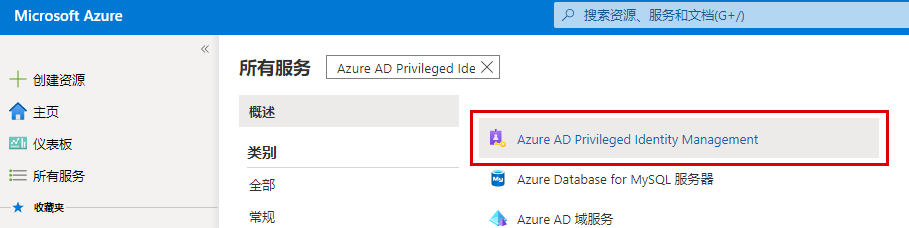

# 模块 3 - 实验室 2 - 练习 2 - 分配目录角色

### 任务 1：  确保用户有资格担任相关角色

在以下任务中，你将使用户有资格获得 Azure AD 目录角色。

1.  登录至 Azure 门户

1.  在 Azure 门户中，单击“**所有服务**”，搜索并选择 `Azure AD Privileged Identity Management`。

     

1.  选择“**角色**”。若此选项仍为灰色，可能需要刷新浏览器。

1.  选择 `Billing Administrator`。

1.  选择“**+ 添加分配**”以打开“选择成员”。在“添加分配”屏幕中单击“**未选择成员**”。

1.  在“**选择成员**”屏幕中选择 `Patti Fernandez`，然后单击“**选择**”。

1.  在“添加分配”屏幕中，单击“**下一步**”。单击“**分配**”。在分配窗口中查看添加的成员。

1.  分配角色后，选择的用户将在成员列表中显示为“**合格**”角色。 

### 任务 2：将角色分配永久化

若要将某个角色分配设为永久，请执行以下步骤。

1.  在 Azure 门户中，单击“**所有服务**”，搜索并选择 `Azure AD Privileged Identity Management`。

     

1.  单击“**Azure AD 角色**”。

1.  单击“**分配**”。
 
1.  单击“**更新**”将 Patti 更新为计费管理员，然后选中“**永久合格**”框。在成员资格设置中单击“**保存**”。

**结果**：现在，计费管理员现在被列为 Patti Fernandez 的**永久**角色。换句话说，Patti 有提升为计费管理员角色的永久资格。

### 任务 3：从角色中删除用户

你可以从角色分配中删除用户，但请确保始终至少有一个用户是永久全局管理员。

1.  在 Azure 门户中，单击“**所有服务**”，搜索并选择 `Azure AD Privileged Identity Management`。

     

1.  单击“**Azure AD 角色**”。

1.  单击“**分配**”。

1.  使用成员筛选器再次选择“Patti Fernandez”。
 
1.  在“符合条件的分配”下的“操作”区域中，单击“**删除**”。
 
1.  在要求你确认的消息中，单击“**是**”。将删除角色分配。

# 继续进行练习 3
