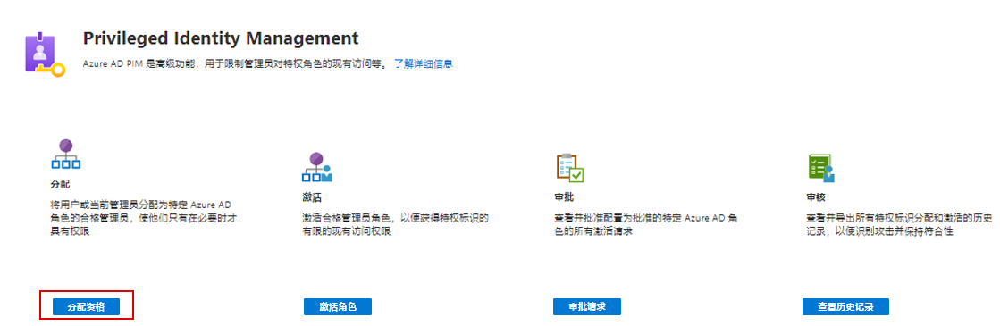
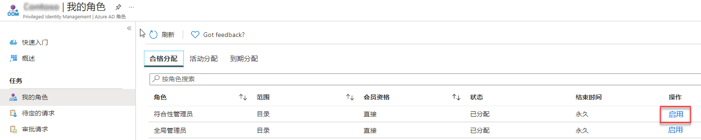
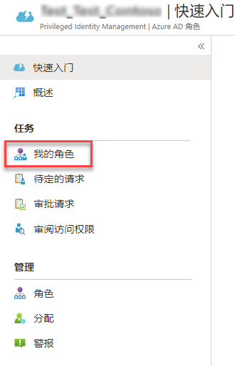
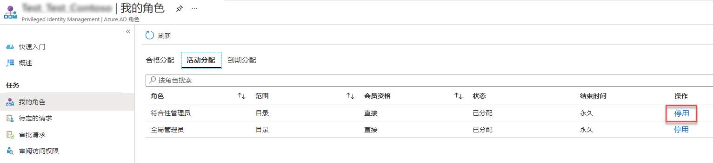
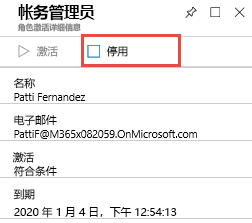

# 模块 3 - 实验室 2 - 练习 3 - 激活和停用 PIM 角色

### 任务 1：激活角色

当你需要承担 Azure AD 目录角色时，可以使用 PIM 中“**我的角色**”导航选项。

1.  在 Azure 门户中，以 Holly 的身份登录，单击“**所有服务**”，搜索并选择 `Azure AD Privileged Identity Management`。

     

1.  单击“**Azure AD 角色**”。
 
1.  单击“**快速开始**”，然后单击“**分配资格**”。

     

1.  单击 `Billing Administrator` 并将 Patti Fernandez 重新添加到“**计费管理员**”角色。

1.  打开 **In Private** 浏览会话并导航到 `https://portal.azure.com`，使用 **Patti** 的 UPN（例如 PattiF@YourTenantHere.onmicrosoft.com）和实验室托管服务提供商提供的密码（提示：该密码可能与 MOD 管理员密码相同）以 Patti 的身份登录。  

1.  在 Azure 门户中，单击“**所有服务**”，搜索并选择“**Azure AD Privileged Identity Management**”。

     

1.  单击“**Azure AD 角色**”。

1.  单击“**快速开始**”，然后单击“**激活你的角色**”。

1.  在“计费管理员”角色上，向右滚动并单击“**激活**”。

     

1.  单击“**先验证你的身份再继续**”（如果其出现在此处）。每个会话只需进行一次身份验证。运行向导以对 Patti 进行身份验证。
 
1.  返回 Azure 门户后，单击“**所有服务**”，搜索并选择 `Azure AD Privileged Identity Management`。

1.  选择“**Azure AD 角色**”，然后在“**快速启动**”边栏选项卡上单击“激活你的角色”。

1.  在“计费管理员”角色上，向右滚动并单击“**激活**”。

     

1.  输入激活原因，然后单击“**激活**”

     

默认情况下，除非在设置中显式配置，否则角色无需批准。 

 如果角色不需要批准，则会激活该角色并将其添加到活动角色列表中。若要立即使用该角色，请按照下一部分中的步骤操作。

 如果角色需要批准才能激活，浏览器右上角会显示一条通知，通知你该请求正在等待批准。

### 任务 2：激活后立即使用角色

在 PIM 中激活角色时，最多可能需要 10 分钟才能访问管理门户或在特定管理工作内执行功能。要强制更新你的权限，请按照下列步骤使用“**应用访问**”：

1.  单击“**注销**”。

1.  在 inPrivate 浏览会话中以 Patti 的身份重新登录。

### 任务 3：查看你的请求状态

你可以查看要激活的待处理请求状态。

1.  仍以“**Patti**”的身份登录，在 Azure 门户中，单击“**所有服务**”，搜索并选择 `Azure AD Privileged Identity Management`。

1.  单击“**Azure AD 角色**”。

1.  单击“**待处理请求**”，查看你的请求列表。

### 任务 4：停用角色

激活角色后，到达其时间限制（合格时间）后，将自动停用。

如果你提早完成管理员任务，则还可以在 Azure AD 特权身份管理中手动停用角色。

1.  仍以“**Patti**”的身份登录，打开 Azure AD Privileged Identity Management。

1.  单击“**Azure AD 角色**”。

1.  单击“**我的角色**”。

     

1.  单击“**活动分配**”，查看活动角色列表。

1.  找到你完成使用的角色，然后单击“**停用**”。

     

1.  再次单击“**停用**”。

     

# 继续进行练习 4
