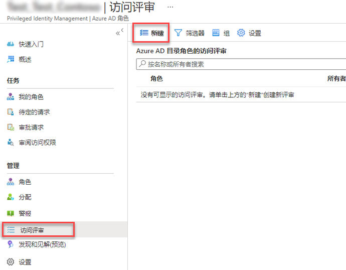
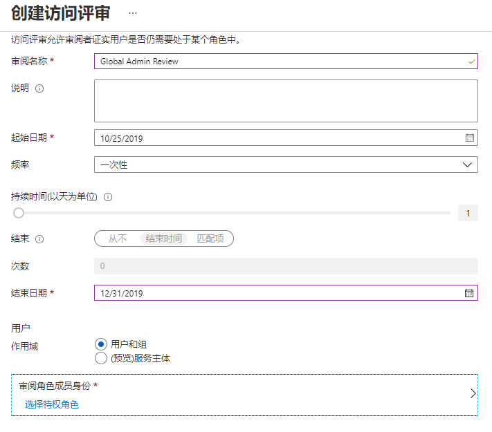
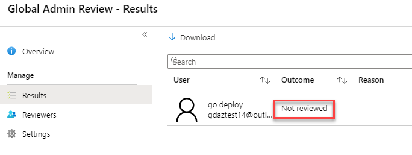
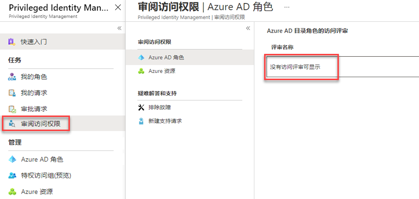

# 模块 3 - 实验室 2 - 练习 4 - 目录角色（普通）

### 任务 1：对 PIM 中的 Azure AD 目录角色启动访问检查

当用户有不再需要的特权访问时，角色分配将变为“过时”。 为了降低与这些过时角色分配相关联的风险，特权角色管理员或全局管理员应定期创建访问评审来让管理员审阅用户的已分配角色。 此任务包括在 Azure AD 特权身份管理 (PIM) 中启动访问检查的步骤。

1.  返回以全局管理员帐户 Holly Dickson 登录的浏览器。

1.  在 PIM 应用程序主页上，选择“管理”部分下的“Azure AD 角色”，然后依次选择“访问评审”和“新建”   。

     

1.  输入以下详细信息，然后单击“开始”：

      - 评审名称：`Global Admin Review`
      - 开始日期：`Enter Today's Date` 
      - 频率：`Drop down to One time`
      - 结束日期：`Enter End of next month`
      - 评审角色成员身份：`Global Administrator`
      - 审阅者：`Holly Dickson`
 
 
     
 
1.  评审完成且状态为活动后，单击“全局管理员评审”。 可能需要刷新 Azure 中的视图。

1.  选择“结果”并查看“未评审”的结果 。

     

### 任务 2：批准或拒绝访问

批准或拒绝访问权限时，只是告诉评审人你是否仍要使用此角色。 如果想要继续充当此角色，请选择“批准”；如果不再需要此访问权限，请选择“拒绝”。  状态不会立即更改，只会在审查人应用结果之后才更改。 请遵循以下步骤来查找并完成访问权限审查：

1.  在 PIM应 用程序中，选择“审查访问”。 

2.  选择“全局管理审查”。

     

3.  除非该审查是由你创建的，否则你会显示为该审查中的唯一用户。 选中 Holly Dickson 旁边的复选框，然后单击“查看”。

     

5.  关闭“审查 Azure AD 角色”边栏选项卡。

### 任务 3：完成对 PIM 中 Azure AD 目录角色的访问审查

访问评审开始后，特权角色管理员可以评审特权访问。 Azure AD Privileged Identity Management (PIM) 会自动发送一封提示用户审阅其访问的电子邮件。 如果用户未收到电子邮件，可以向他们发送如何执行访问评审的相关说明。

访问评审期结束或所有用户都完成了自我评审后，请按照此任务中的步骤管理评审并查看结果。

1. 转到 Azure 门户并选择 `Azure AD Privileged Identity Management`。

1. 选择“Azure AD 角色”。

2. 选择“访问审查”。

3. 选择“全局管理审查”。 

4. 选择一个可用选项以完成评审：
     - 停止 - 所有访问评审都有结束日期，但可以使用“停止”按钮提前结束。 如果此时还有未审阅的用户，他们在停止审阅后将无法再得到审阅。 停止后，无法重新开始审阅。
     - 应用 - 完成访问评审后，无论是因为到达了结束日期还是手动停止了评审，“应用”按钮都会实现评审结果。 如果在审阅中拒绝了用户的访问，在此步骤中将删除其角色分配。
     - 删除 - 如果不想要进一步了解评审，请将其删除。 “删除”按钮可从 Privileged Identity Management 服务中删除评审。

### 任务 4：在 PIM 中为 Azure AD 目录角色配置安全警报

可以在 PIM 中自定义某些安全警报，以处理环境和安全目标。 执行以下步骤打开安全警报设置：

1.  打开 `Azure AD Privileged Identity Management`。

1.  单击“Azure AD 角色”。

1.  依次单击“警报”和“设置” 。

1.  单击警报名称以配置该警报的设置。

# 继续进行练习 5
