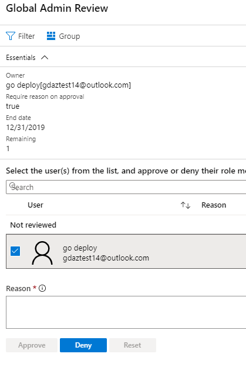

# 模块 3 - 实验室 2 - 练习 4 - 目录角色（普通）

### 任务 1：对 PIM 中的 Azure AD 目录角色启动访问检查

当用户具有不再需要的访问特权时，角色分配将变为“过期”。为了降低与这些过期角色分配有关的风险，特权角色管理员或全局管理员应定期创建访问权限检查，要求管理员检查已授予为用户的角色。此任务包括在 Azure AD 特权身份管理 (PIM) 中启动访问检查的步骤。

1.  返回以全局管理员帐户 Holly Dickson 登录的浏览器。

1.  在 PIM 应用程序主页上，选择“**管理**”部分下的“**Azure AD 角色**”，然后依次选择“**访问评审**”和“**新建**”。

     

1.  输入以下详细信息，然后单击“**开始**”：

      - 审查名称： `Global Admin Review`
      - 开始日期： `Enter Today's Date` 
      - 频率： `Drop down to One time`
      - 结束日期： `Enter End of next month`
      - 评审角色成员身份： `Global Administrator`
      - 评审人： `Holly Dickson`
 
 
     
 
1.  评审完成且状态为活动后，单击“**全局管理员评审**”。可能需要刷新 Azure 中的视图。

1.  选择“**结果**”并查看“**未评审**”的结果。

     

### 任务 2：批准或拒绝访问权限

批准或拒绝访问权限时，只是告诉评审人你是否仍要使用此角色。如果你想保留该角色，请选择批准；如果你不再需要访问权限，请选择拒绝。你的状态不会立即变更，直到审查人应用结果后方可变更。请按照以下步骤查找并完成访问审查：

1.  在 PIM应 用程序中，选择“**审查访问**”。 

2.  选择“**全局管理审查**”。

     

3.  除非你创建了审查，否则你将成为审查中的唯一用户。选中 Holly Dickson 旁边的复选框，然后单击“**查看**”。

     

5.  关闭“**查看 Azure AD 角色**”刀片服务器。

### 任务 3：完成对 PIM 中 Azure AD 目录角色的访问审查

开始访问审查后，特权角色管理员可以审查特权访问。Azure AD 特权身份管理 (PIM) 将自动发送一封电子邮件，提示用户查看其访问权限。如果用户没有收到电子邮件，你可以向他们发送有关如何执行访问权限审查的说明。

访问评审期结束或所有用户都完成了自我评审后，请按照此任务中的步骤管理评审并查看结果。

1. 转到 **Azure 门户**并选择 `Azure AD Privileged Identity Management`。

1. 选择“**Azure AD 角色**”。

2. 选择“**访问审查**”。

3. 选择“全局管理审查”。 

4. 选择一个可用选项以完成评审：
     - **停止** - 所有访问评审都有结束日期，但可以使用“停止”按钮提前结束。如果此时还有未评审的用户，他们在停止评审后将无法再得到评审。停止后，无法重新开始评审。
     - **应用** - 完成访问评审后，由于已到达结束日期或已手动停止评审，因此可通过“应用”按钮实现评审结果。如果在评审中拒绝了用户的访问，此步骤将删除其角色分配。
     - **删除** - 如果不想要进一步了解评审，请将其删除。使用“删除”按钮可从 Privileged Identity Management 服务中删除评审。

### 任务 4：在 PIM 中为 Azure AD 目录角色配置安全警报

你可以在 PIM 中自定义一些安全警报，以处理你的环境和安全目标。请按照以下步骤打开安全警报设置：

1.  打开 `Azure AD Privileged Identity Management`。

1.  单击“**Azure AD 角色**”。

1.  依次单击“**警报**”和“**设置**”。

1.  单击警报名称以配置该警报的设置。

# 继续进行练习 5
