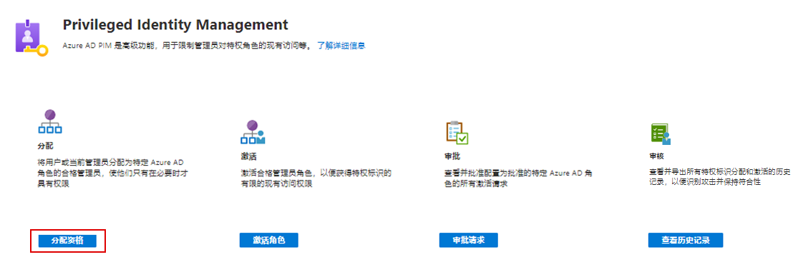
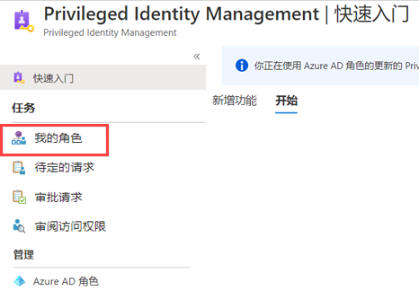
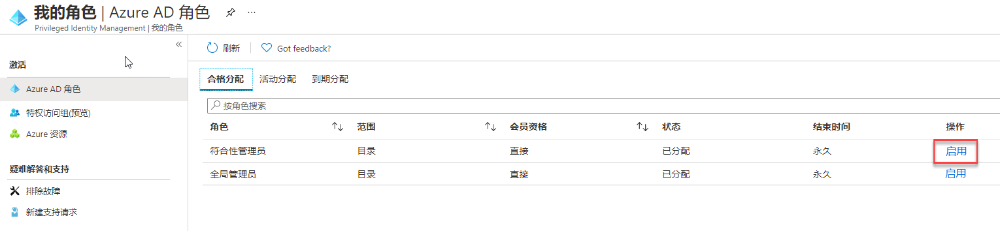
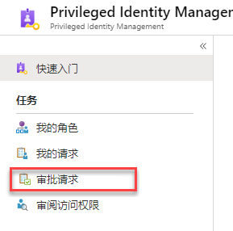
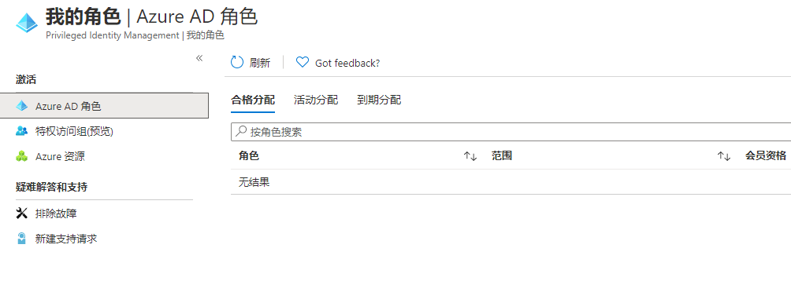

# 模块 3 - 实验室 2 - 练习 5 - PIM 资源工作流

### 任务 1：配置全局管理员角色，以请求批准。

1.  你仍应以上次练习中 Holly 的身份登录。  打开 `Azure AD Privileged Identity Management`。

1.  单击“Azure AD 角色”。

1.  单击 **“设置”** 

1.  选择 `Global Administrator`。

1.  单击“编辑”，向下滚动并选中“需要批准才能激活” 。  

2.  单击“选择审批者”，将 Holly Dickson 指定为审批者并单击“选择” 。  然后单击“更新”。

### 任务 2：为 Patti 启用全局管理员特权。

1.  打开“Azure AD Privileged Identity Management”。

1.  单击“Azure AD 角色”。

1.  单击“快速开始”，然后选择“分配资格”。

     

1.  选择“全局管理员”。

1.  选择“+ 添加分配”，然后在“选择成员”下选择“Patti Fernandez”。   单击“选择”。

2.  单击“下一步”，然后单击“分配” 。

1.  打开一个 InPrivate 浏览会话，并以 Patti Fernandez 的身份登录 `https://portal.azure.com`。  你可能在之前的练习中就已打开此浏览器。

1.  打开“Azure AD Privileged Identity Management”。

1.  选择“我的角色”。

     

1.  “激活”全局管理员角色。

     

1.  如有必要，请使用向导验证 Patti 的身份。

1.  在“Azure AD Privileged Identity Management”中返回“我的角色” 。

1.  单击全局管理员角色附近的“激活”。

1.  输入激活原因“我需要执行一些管理任务”，然后单击“激活” 。

最后，你应该会看到一条通知，指示请求“正在等待审批”。

### 任务 3：批准或拒绝 PIM 中 Azure 资源角色的请求

利用 Azure AD Privileged Identity Management (PIM)，可以将角色配置为需要审批才可激活，还可选择一个或多个用户或组作为委派的审批者。 按照本文中的步骤，审批或拒绝 Azure 资源角色的请求。

###### 查看待处理请求

作为委派的审批者，当 Azure 资源角色请求正在等待审批时，你将收到一封电子邮件通知。 可在 PIM 中查看这些待处理的请求。

1.  切换回你使用全局管理帐户 Holly Dickson 登录的浏览器。

1.  打开“Azure AD Privileged Identity Management”。

1.  单击“审批请求”。

     

1.  选择来自 Patti 的请求，然后单击“批准”。

1.  输入原因“同意执行该任务”，然后单击“确认” 。

1.  出现一条通知，显示 Patti 已获批准。

1.  切换回 Patti 登录的 In Private 浏览会话，单击“我的角色”，然后选择“活动分配”，注意状态现为已激活全局管理员 。

     

# 继续进行练习 6
