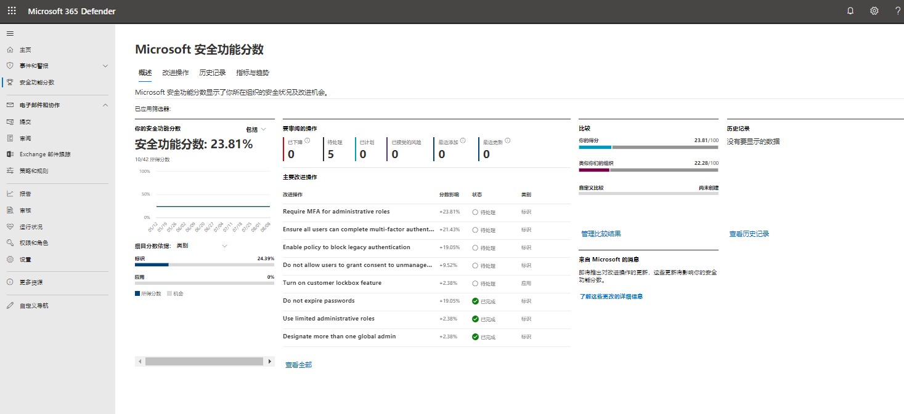

# 模块 4：实验室 1 - 练习 1 - 提高 Microsoft 365 安全中心的安全功能分数

你是全局管理员 Holly Dickson，并且已登录 Microsoft 365。

在这么多服务提供安全好处的情况下，Holly 通常很难知道应该先采取什么步骤来保护她的组织部署。Microsoft 安全功能分数会审核她的安全建议并确定这些建议的优先级，以便她了解要先执行哪些建议。在此练习中，Holly 将查看她的组织的 Microsoft 安全功能分数，并使用门户采取建议的操作，从而提高分数。

**安全功能分数计算**

安全中心模仿安全分析师的工作，审查你的安全建议并应用高级算法来确定每项建议的重要性。

Microsoft 安全中心会不断检查你的活动建议，并根据这些建议计算你的安全功能分数，该建议的分数来自其严重性和最佳安全做法，这将对工作负载的安全性产生最大影响。

### 任务 1：在 Microsoft 365 安全门户中查看安全功能分数。

1.  使用以下密码以管理员身份登录到 **LON-CL1** 虚拟机：`Pa55w.rd`。转到 Microsoft 365 安全中心仪表板 `https://security.microsoft.com`，并使用 Holly 的全局管理员凭据登录，在仪表板上选择“**Microsoft 安全功能分数**”。

2.  在顶部，你可以看到安全功能分数突出显示：

       - 安全功能分数表示每个策略、每个选定**订阅的分数**
       - 按类别划分的安全功能分数显示哪些资源需要最多的关注
 
       

    
      **备注**：每个订阅的安全功能分数总和不等于总体安全功能分数。安全功能分数基于你的运行状况资源与每个建议的总资源之间的比率进行计算，而不是基于你的订阅的安全功能分数的总和。 

3.  选择“**改进操作**”以查看你可以采取哪些操作来提高该订阅的安全功能分数。

4.  在操作列表中，可在其中看到每个操作都有一列表示“**得分**”。该数字表示通过采取操作可能获得的分数。例如，在下面的屏幕中，如果你“**要求管理角色进行 MFA**”，最多可以获得十分。

### 任务 2：查看 Microsoft 安全功能分数历史记录。

此外，单击“**历史记录**”选项，就可以查看安全功能分数的历史记录。  

你可以自定义视图的日期范围并关注特定的安全功能分数类别。这将使你了解你的安全状况如何随着时间的推移而发生变化。

安全功能分数历史记录视图还列出了你已采取的具体操作及其对分数的影响。

### 任务 3：提高安全功能分数

1.  单击“**改进操作**”选项卡并选择“**启用自助式密码重置**”。将显示有关此安全操作的详细信息。请注意，其中包括采取此操作的具体说明。

2.  单击“**管理**”按钮。在 Azure 门户中，一个新的浏览器选项卡应直接打开到“**密码重置 - 属性**”边栏选项卡。
  
3.  在“**启用自助式密码重置**”下，单击“全部”。 

4.  如果之前的实验室中尚未将其设置为“全部”，请单击“**保存**”。

5.  在管理区域单击“**注册**”。

6.  确保“要求用户在登录时注册?”标记为“**是**”。
 
7.  将要求用户重新确认其身份验证信息的天数更改为 `90` 天。

8.  单击“**保存**”。

9.  返回“Microsoft 安全功能分数”浏览器选项卡。

10. 在备注的“启用自助式密码重置”窗格中，输入“**在 <输入今天的日期> 为所有用户启用自助式密码重置**”，然后单击“**保存并关闭**”。

**备注：** 分数更新可能需要 24 小时才能出现在你的 Microsoft 安全功能分数中。此外，部分分数可能会根据操作给出。  例如，此租户包括 10 个许可用户，如果只为两个用户启用了自助式密码重置，则此操作将获得 1/5 分。

在 24 小时后返回 Microsoft 安全功能分数，查看分数的更改并重新访问“历史记录”选项卡。

**结果**：在本实验室中，你学习了如何在 Microsoft 安全中心中提高安全功能分数。

# 实验室结束 
