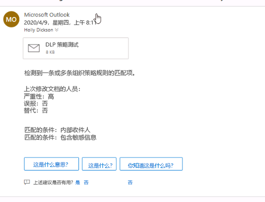

# 模块 11 - 实验室 1 - 练习 2 - 测试 DLP 策略

你现在处于试点项目中需要测试策略的阶段。 你已决定测试与包含敏感信息的电子邮件相关的 DLP 策略。 

### 任务 1 – 针对敏感电子邮件测试 DLP 策略

在之前的练习中，你已经创建自定义 DLP 策略，该策略在 Adatum 租户中搜索电子邮件中是否有与美国社会安全号码相关的敏感信息。 在此练习中，你会将一封包含社会安全号码的电子邮件从 Holly Dickson 发送到 Alex Wilber。

1. 切换到客户端 1 VM (LON-CL1)，在该客户端中，你应该已经使用密码 `Pa55w.rd` 以 Holly Dickson (holly@M365xZZZZZZ.onmicrosoft.com) 的身份登录到 Microsoft 365。  

2. 现在将电子邮件从 Holly 发送到 Alex；该电子邮件包含美国社会安全号码。 在 Microsoft Edge 中，“Outlook 网页版”选项卡应该仍处于打开状态，以供 Holly 使用 。 选择“Outlook 网页版”选项卡。如果没有打开浏览器到 `https://portal.office.com`，请确保以 Hooly Dickson 的身份登录并选择“Outlook”。

3. 在屏幕左上角，选择“新建邮件”。 

4. 在屏幕右侧显示的消息窗格中，输入以下信息：

    - 收件人：开始键入 `Alex`，此时出现一个显示以 Alex 开头的用户名的下拉菜单。 选择“Alex Wilber”。

    - 添加主题：`DLP Policy Test`

    - 消息区域：键入 `This customer has social security number: 489-36-8350`。

    > **注意**：使用的 SSN 是虚构的，源自数据丢失防护策略的示例数据的公共存储库。 测试这些策略时，请勿输入个人信息。

5. 选择“发送”。

6. 现在将第二封邮件从 Holly 发送到 Alex，该邮件包含多个社会安全号码。  在屏幕左上角的“Outlook”中，选择“新建邮件” 。 

7. 在屏幕右侧显示的消息窗格中，输入以下信息：

    - 收件人：开始键入 `Alex`，此时出现一个显示以 Alex 开头的用户名的下拉菜单。 选择“Alex Wilber”。

    - 添加主题：`multiple SSN test`

    - 消息区域：`SSN = 489-36-8350 and another customer SSN 514-14-8905 and a third 690-05-5315`

8. 选择“发送”。

9. 切换到客户端 2 VM (LON-CL2)。 

10. 如果你需要登录到 VM，系统会默认显示管理员帐户，因此在“密码”字段中输入 `Pa55w.rd`。  

11. 切换到客户端 2 VM (LON-CL2)。

12. 如果 Microsoft Edge 浏览器中仍有登录的会话，则从当前用户帐户注销，然后关闭所有 Microsoft Edge 浏览器选项卡 。

13. 打开 Edge 浏览器，最大化窗口，然后在地址栏中输入以下 URL：`https://outlook.office365.com`

14. 需要以“Alex Wilber”身份登录到 Outlook 网页版 。 如果“选择一个帐户”窗口出现，Alex 的帐户将不会出现，因为她之前没有登录过。 因此，选择“使用其他帐户”。 

15. 在“登录”窗口中，输入 AlexW@M365xZZZZZZ.onmicrosoft.com（其中 ZZZZZZ 是实验室托管提供商提供的唯一租户 ID），然后选择“下一步”。  

16. 在“输入密码”窗口中，输入 Alex 的密码（提示：此密码可能和 MOD 管理员密码相同），然后选择“登录” 。

17. 在“保持登录?”窗口中，选择“不再显示此内容”，然后选择“是”  。

18. 如果第一次访问此网站，系统可能会要求设置语言和时区：

    - 从“语言”下拉列表中选择“英语(美国)”。 

    - 从“时区”下拉列表中选择你需要的时区。

19. 选择“保存”  。

20. 如果出现一个窗口询问是否想要尝试新的 outlook，选择“尝试新的 Outlook”。

21. 如果出现“欢迎”窗口，请立即关闭该窗口。

22. 在“Outlook 网页版”中的 Alex 的收件箱中，你应该可以看到 Holly 刚刚发送给 Alex 的电子邮件，其中包含一个 SSN 号码 。

23. 包含多个 SSN 的电子邮件本应被阻止，Holly 的收件箱（在 LON-CL1 上）应该会出现如下所示的警告消息：

     

24. 本练习的最后一个操作是从 Alex 的收件箱中删除此邮件。 你已经成功测试自定义 DLP 策略。

25. 将两个客户端 VM 保持打开状态以用于下一个实验室。 请不要关闭任何浏览器选项卡。

排除此实验室的故障

“什么也没有发生，两封电子邮件都发送给了 Alex”。
  
1. DLP 策略传播租户可能需要许多分钟。  很有可能发生的一种情况是在该策略和后续扫描有机会在租户中执行前，你就将电子邮件发送给了 Alex。  如果这种情况发生，请返回此实验室，重新发送电子邮件。

2. 另一种可能的情况是电子邮件正文中的 SSN 格式设置不恰当。  DLP 策略中的敏感信息类型扫描的数据是以该数据类型常用的特定方式进行格式设置的数据。  如果单击下面的链接，你可以确切看到为确保 DLP 策略扫描检测到美国社会安全号码，该号码必须遵循的格式设置方式。
[https://docs.microsoft.com/en-us/microsoft-365/compliance/what-the-sensitive-information-types-look-for?view=o365-worldwide#us-social-security-number-ssn](https://docs.microsoft.com/en-us/microsoft-365/compliance/what-the-sensitive-information-types-look-for?view=o365-worldwide#us-social-security-number-ssn)

3. 检查 DLP 策略配置。 确保已按照之前练习中描述的那样配置策略。

这是用于测试各种 DLP 策略配置的不错的实验室。 成功完成此实验室后，请考虑重新配置此 DLP 策略，以触发其他结果。

# 实验室结束
